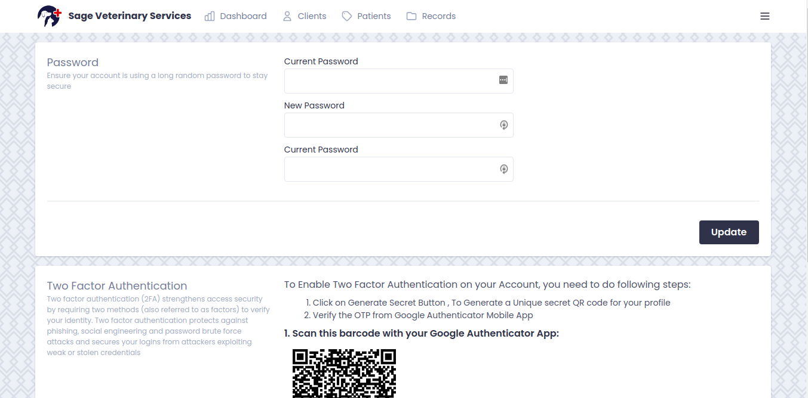

# Sage

A simple and secure management system for veterinary clinics

## Description

Sage is a project I worked on for a friend who is a practising Veterinary Doctor.
He wanted to web application to replace the manual record taking done at most
clinic.
The primary data to be collected are:
- Clients (the people who bring their pets/animal to the clinic)
- Patients (the pets/animals)
- Records (the desease dignosing data collected per visit)

Clients have many Patients and Patients have many Records. This means that Clients have many Records through Patients.

## Features

Some of the notable features the application had are:
- Mailing
- Multi-factor Authentication
- Password confirmation before editing settings
- Email verification
- Ability to logout other devices
- Preventing users from using dumb password
- Easy creating new entries from others
- View history of users

## Screen Shots

Below are few screen shots taken from the application.

